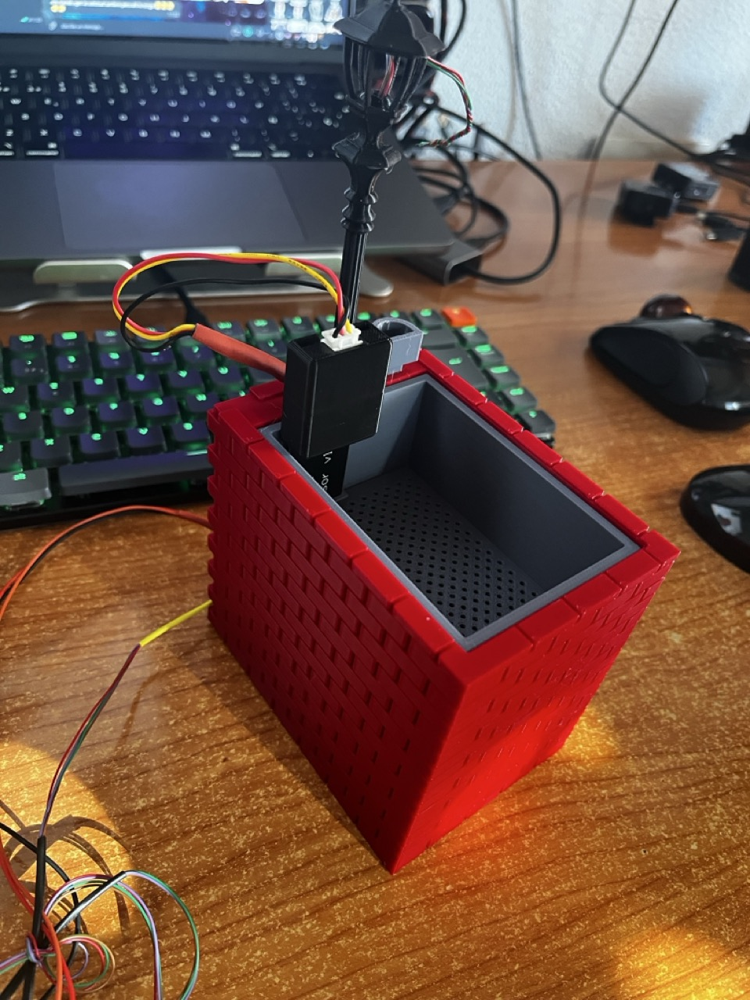

# Smart Plant 3D con sensor de humedad en tierra y Farola Led indicando estado

Proyecto actualmente en curso y una etapa de desarrollo temprana.
Actualmente solo tengo los diseños en 3D, esquemas del proyecto, la base del proyecto y código para la mayoría de las funcionalidades desarrollados en otros proyectos de forma simplificada para experimentar antes de unirlos en este.

Proyecto de Smart Plant con el que monitorizar el cultivo de plantas en macetas y regarlas cuando sea necesario. Se toman lecturas de luz, humedad, uva, humedad en tierra.

  
  
  
  

## Modelo para la caja 3D

Actualmente está en fase de prototipo y he decidido no subirlo hasta completarlo para ahorrarme
subir modificaciones con las correcciones que puedan surgir.

Puedes seguirme en thingiverse en el siguiente enlace si quieres o volver en el futuro:
[https://www.thingiverse.com/raupulus/designs](https://www.thingiverse.com/raupulus/designs)

## Preparar proyecto

Antes de comenzar, hay que copiar el archivo **.env.example.py** a **.env** y rellenar las variables con los datos del wireless y de acceso a la API.

Una vez preparado, subir a la raspberry todo el contenido menos el directorio **docs** que es solo informativo o de imágenes.
