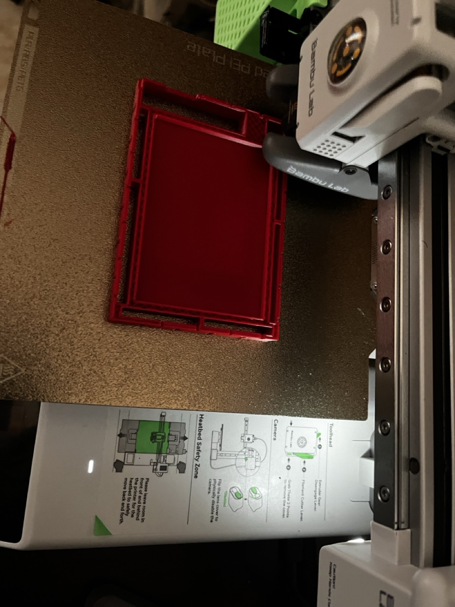
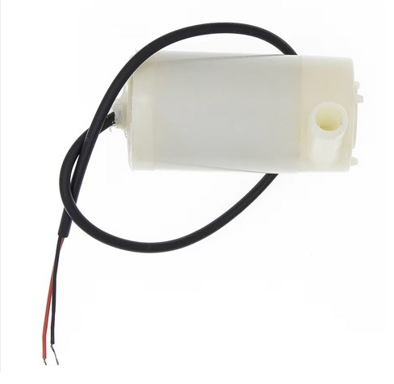

# Smart Plant 3D con sensor de humedad en tierra y Farola Led indicando estado

Proyecto actualmente en curso y una etapa de desarrollo temprana.
Actualmente solo tengo los diseños en 3D, esquemas del proyecto, la base del proyecto y código para la mayoría de las funcionalidades desarrollados en otros proyectos de forma simplificada para experimentar antes de unirlos en este.

Proyecto de Smart Plant con el que monitorizar el cultivo de plantas en macetas y regarlas cuando sea necesario. Se toman lecturas de luz, humedad, uva, humedad en tierra.

  
  
  
  

## Modelo para la caja 3D

Actualmente está en fase de prototipo y he decidido no subirlo hasta completarlo para ahorrarme
subir modificaciones con las correcciones que puedan surgir.

Puedes seguirme en thingiverse en el siguiente enlace si quieres o volver en el futuro:
[https://www.thingiverse.com/raupulus/designs](https://www.thingiverse.com/raupulus/designs)

## Hardware

- Microcontrolador principal: **Raspberry pi pico w**
- Mini bomba de agua 3v
- Interruptor de boya con iman para detectar si queda agua
- Bombilla LED de 3 colores integrados para la indicación de humedad en tierra en la farola

  
  
  
  

## Sensores utilizados

- Sensor de humedad en tierra: Capacitive Soil Moisture sensor v1.2
- Sensor UV/UVA/UVB: VEML6075
- Sensor de temperatura y humedad: Bosh BME280

  
  
  

## Preparar proyecto

Antes de comenzar, hay que copiar el archivo **.env.example.py** a **.env** y rellenar las variables con los datos del wireless y de acceso a la API.

Una vez preparado, subir a la raspberry todo el contenido menos el directorio **docs** que es solo informativo o de imágenes.

## TODO

- Terminar de plantear lista de componentes
- Encuadrar componentes con el diseño para que quede compacto sin colisiones entre piezas
- Plantear entrada con conector microusb u otro tipo
- Plantear cómo/dónde poner led para indicar que no queda agua en el deposito
- Plantear como sacar un pin desde el que comunicar que necesita riego o si centralizar en la api la información para regar centralizando el riego en el exterior
- Plantear cómo llega el agua por un tubo hacia el deposito por el conducto ya existente
- Arreglar diseño 3D para la maceta, tiene una esquina con imperfecciones y ha quedado un modelo demasiado pesado para trabajarlo en algunos programas (freecad se cuelga bastante)
